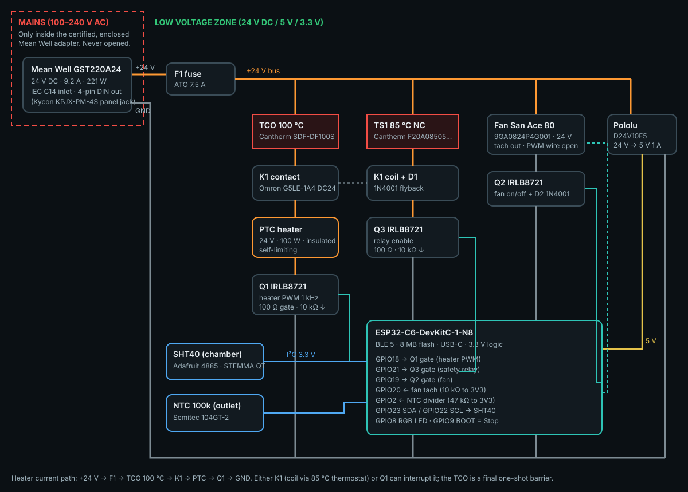
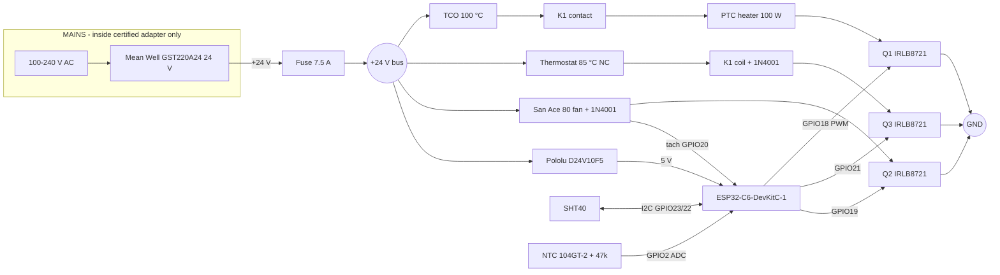

# SpoolDry Hardware (rev 1)

Low-voltage architecture: **all mains voltage stays inside the certified, enclosed Mean Well adapter**. The user only
wires 24 V DC / 5 V / 3.3 V. Chamber limit **70 °C** (set by the fan's 70 °C rating); firmware cut-off 80 °C;
independent 85 °C thermostat and 100 °C one-shot thermal cutoff.

## Selection summary

| Role | Selected | Key reason |
|---|---|---|
| MCU board | **Espressif ESP32-C6-DevKitC-1-N8** (manufacturer: Espressif Systems; MCU ESP32-C6, RISC-V 160 MHz; BLE 5 + Wi-Fi 6 + 802.15.4; USB-C ×2 (UART bridge + native USB); 3.3 V logic, 5 V input via pin) | official board, mature Arduino 3.x + NimBLE support, 8 MB flash for future dual OTA, sold by DigiKey/Mouser |
| Sensor | **Sensirion SHT40** (Adafruit #4885) | ±0.2 °C / ±1.8 %RH, CRC, rated to 125 °C |
| Heater | **24 V / 100 W insulated PTC air heater** | no mains switching; PTC self-limits without airflow |
| Fan | **San Ace 80 9GA0824P4G001** 24 V, pulse sensor | ball bearing, 70 °C rating, tach for stall detection |
| Switches | **Infineon IRLB8721PBF** ×3 (heater PWM, fan, relay coil) | logic-level at 3.3 V, 8.7 mΩ |
| 2nd heater switch | **Omron G5LE-1A4 DC24** relay | independent of the MOSFET |
| HW over-temp | **Cantherm F20A08505ACFA06E** 85 °C NC thermostat in the relay-coil circuit; **Cantherm SDF-DF100S** 100 °C TCO in the heater current | firmware-independent protection |
| Power | **Mean Well GST220A24-R7B** 24 V 9.2 A | certified, enclosed; headroom for PTC inrush |

Rejected alternatives: ESP32-C3 SuperMini (clone quality/antenna variance, 4 MB), DHT11/DHT22 (accuracy, speed),
AHT20 (high-RH accuracy), mains-voltage heaters (user mains wiring), sleeve-bearing PC fans (no tach, low temp rating).

## Bill of Materials

| Part | Purpose | Specification | Qty | Example links |
|---|---|---|---|---|
| Espressif ESP32-C6-DevKitC-1-N8 | Controller: BLE link, sensors, control loop and all firmware safety logic. | ESP32-C6-WROOM-1 · RISC-V 160 MHz · BLE 5 · Wi-Fi 6 · 8 MB flash · 2× USB-C · 3.3 V logic | 1 | [DigiKey](https://www.digikey.com/en/products/detail/espressif-systems/ESP32-C6-DEVKITC-1-N8/17728861) · [Adafruit](https://www.adafruit.com/product/5672) · [Espressif user guide](https://documentation.espressif.com/esp-dev-kits/en/latest/esp32c6/esp32-c6-devkitc-1/user_guide.html) |
| Sensirion SHT40 breakout (Adafruit #4885) | Measures chamber temperature and relative humidity. | ±0.2 °C / ±1.8 %RH typ. · −40…125 °C · I²C 0x44 · STEMMA QT | 1 | [Adafruit](https://www.adafruit.com/product/4885) · [DigiKey](https://www.digikey.com/en/products/detail/adafruit-industries-llc/4885/13694670) |
| Insulated PTC air heater 24 V / 100 W | Heats the air that the fan blows through the chamber. | 24 V DC · ~100 W (≈4.2 A) · finned aluminium · insulated housing · self-limiting ≤200 °C surface · ~113×35×26 mm | 1 | [Amazon (Bestol 24V 100W)](https://www.amazon.com/Bestol-Insulated-Ceramic-Elements-Electric/dp/B081NRGVJ9) · [VXB](https://vxb.com/products/multi-voltage-insulated-ptc-ceramic-air-heater-12v) · [DBK (industrial PTC, alternative)](https://www.dbkusa.com/shop/ptc-air-heater-v) |
| San Ace 80 9GA0824P4G001 (24 V, tach) | Moves air through the PTC heater and around the spools; removes moist air. | 80×80×25 mm · 24 V · 0.21 A · 67 CFM · pulse sensor (2 p/rev) · −20…+70 °C · 60,000 h at 60 °C | 1 | [Sanyo Denki](https://products.sanyodenki.com/en/sanace/dc/dc-fan/9GA0824P4G001/) · [Mouser (9GA0824P4 series)](https://www.mouser.com/en/ProductDetail/Sanyo-Denki/9GA0824P4H001?qs=JgUGn%2FCSypxlh5ecR4Dv4g%3D%3D) |
| Infineon IRLB8721PBF logic-level N-MOSFET | Low-side switches for heater PWM (Q1), fan (Q2) and relay coil (Q3). | 30 V · 62 A · R_DS(on) 8.7 mΩ @ 4.5 V · TO-220 · with 100 Ω gate resistor + 10 kΩ pull-down each | 3 | [Adafruit #355](https://www.adafruit.com/product/355) · [Mouser](https://www.mouser.com/ProductDetail/Infineon-Technologies/IRLB8721PBF?qs=9%2BKlkBgLFf0T58WYx%2FAl5A%3D%3D) · [Infineon](https://www.infineon.com/part/IRLB8721) |
| Omron G5LE-1A4 DC24 relay (K1) | Second, independent heater switch in series with the MOSFET. | SPST-NO · 24 V coil · 10 A contacts · + 1N4001 flyback diode | 1 | [DigiKey](https://www.digikey.com/en/products/detail/omron-electronics-inc-emc-div/G5LE-1A4-DC24/369017) · [Omron datasheet](https://omronfs.omron.com/en_US/ecb/products/pdf/en-g5le.pdf) |
| Cantherm F20A08505ACFA06E thermostat (TS1) | Independent hardware over-temperature protection for the chamber. | 85 °C ±5 K · normally closed · auto-reset · potted · 2 A (coil circuit only) | 1 | [DigiKey](https://www.digikey.com/product-detail/en/cantherm/F20A08505ACFA06E/317-1003-ND/306765) · [Cantherm F20 series](https://www.cantherm.com/product_post_type/f13-f20-f23-single-contacts/) |
| Cantherm SDF-DF100S thermal cutoff (TCO) | Last-resort, non-resettable fuse in the heater current path. | 100 °C one-shot · 10 A AC/DC · axial · crimp, do not solder close to body | 1 | [DigiKey](https://www.digikey.com/en/products/detail/cantherm/SDF-DF100S/1014758) |
| Semitec 104GT-2 NTC thermistor + 47 kΩ 1 % resistor | Measures heater-outlet temperature for derating and fault detection. | 100 kΩ @ 25 °C · B 4267 K · glass bead to 300 °C | 1 | [Mouser](https://www.mouser.com/ProductDetail/Semitec/104GT-2/?qs=wgO0AD0o1vvQ2Rm/PgvFdg%3D%3D) |
| Mean Well GST220A24-R7B desktop adapter | Powers everything from 24 V DC. All mains voltage stays inside this certified adapter. | 24 V · 9.2 A · 221 W · enclosed, safety-certified, 3-pin IEC inlet · 4-pin DIN output | 1 | [Mouser](https://www.mouser.com/en/ProductDetail/MEAN-WELL/GST220A24-R7B?qs=XfZQyRplo5QmgbOd16EIcQ%3D%3D) · [Newark](https://www.newark.com/mean-well/gst220a24-r7b/adaptor-ac-dc-24v-9-2a-no-of-outputs/dp/44AC5140) |
| Kycon KPJX-PM-4S panel jack (mates with R7B plug) | Locking 24 V input on the controller box. | 4-pin DIN power jack · panel mount · 7.5 A | 1 | [DigiKey](https://digikey.com/en/products/detail/kycon-inc/KPJX-PM-4S/9990081) · [Kycon datasheet](https://www.kycon.com/Catalog_PDF/KPJX-PM.pdf) |
| ATO blade fuse 7.5 A + Littelfuse inline holder | Protects wiring from short circuits. | Slow-acting automotive blade fuse on +24 V directly after the input jack | 1 | [Littelfuse 0FHA0002XP (Amazon)](https://www.amazon.com/Littelfuse-0FHA0002XP-Carded-Inline-Holder/dp/B004A8THIE) · [Keystone 3557-2 PCB holder](https://us.rs-online.com/product/keystone-electronics/3557-2/70182122/) |
| Pololu D24V10F5 step-down regulator | Feeds the ESP32 board's 5 V pin from 24 V. | 5.1–36 V in · 5 V 1 A out · 18×13 mm | 1 | [Pololu](https://www.pololu.com/product/2831) |
| Small parts | Assembly, connectors and passive components. | Perma-Proto board · Phoenix Contact 1935161 terminal blocks · 3× 100 Ω, 4× 10 kΩ, 1× 47 kΩ 1 % · 2× 1N4001 · STEMMA QT 400 mm cable · 18 AWG silicone wire (heater) · 22 AWG (signals) | 1 | [Adafruit Perma-Proto (Pololu)](https://www.pololu.com/product/2766) · [Phoenix 1935161 (DigiKey)](https://www.digikey.com/en/products/detail/phoenix-contact/1935161/568614) · [Adafruit 1N4001 #755](https://www.adafruit.com/product/755) · [STEMMA QT 400 mm #5385](https://www.adafruit.com/product/5385) |
| Hammond 1591XXDSBK ABS enclosure + insulated dry box | Keeps electronics cool and away from the heated chamber. | 152×82×50 mm controller box outside the hot zone · chamber: rigid, insulated box rated ≥ 90 °C (e.g. PP/ABS with foil-faced insulation), heater duct in aluminium or ASA/PC | 1 | [Hammond 1591XX](https://www.hammfg.com/electronics/small-case/plastic/1591xx) |

Links were checked in October 2026; stock changes. Any part with **equal or better ratings** works.
If the PTC listing disappears, use any *insulated* 24 V PTC air heater ≤ 120 W with aluminium fins; if the San Ace
fan is unavailable, use a 24 V ball-bearing fan with tach output rated ≥ 70 °C (e.g. ebm-papst 8414 N/2… series).

### Why each part
- **Espressif ESP32-C6-DevKitC-1-N8** — Official Espressif board, native BLE 5 with mature NimBLE support, USB-C, 8 MB flash for future dual-slot OTA, sold by major distributors.
- **Sensirion SHT40 breakout (Adafruit #4885)** — Modern, accurate, CRC-protected digital sensor rated to 125 °C. DHT11/DHT22 are slower and far less accurate; AHT20 has no comparable accuracy at high humidity.
- **Insulated PTC air heater 24 V / 100 W** — Low-voltage DC (no mains switching), and PTC ceramic limits its own temperature if airflow fails: a physical safety layer.
- **San Ace 80 9GA0824P4G001 (24 V, tach)** — Industrial ball-bearing fan rated to 70 °C with a tachometer, so the firmware detects a stalled fan and shuts the heater off. This rating sets SpoolDry's 70 °C chamber limit.
- **Infineon IRLB8721PBF logic-level N-MOSFET** — Fully enhanced from 3.3 V logic, runs cool at 4.2 A without a heatsink. Pull-downs keep every load OFF while the ESP32 boots or resets.
- **Omron G5LE-1A4 DC24 relay (K1)** — If Q1 fails shorted, the relay still cuts the heater. Its coil is fed through the 85 °C thermostat, so overheating opens it without any software.
- **Cantherm F20A08505ACFA06E thermostat (TS1)** — Opens the relay-coil circuit at 85 °C regardless of firmware state (rated 2 A, so it switches the coil, not the 4 A heater).
- **Cantherm SDF-DF100S thermal cutoff (TCO)** — Covers the double fault (shorted MOSFET + welded relay). Mount it on the heater duct; replace it if it ever opens and find the cause.
- **Semitec 104GT-2 NTC thermistor + 47 kΩ 1 % resistor** — Detects a stalled fan or stuck heater even if the chamber sensor reads normal.
- **Mean Well GST220A24-R7B desktop adapter** — No user mains wiring. 220 W leaves headroom for PTC inrush (2–3× nominal for seconds) plus fan and electronics.
- **Kycon KPJX-PM-4S panel jack (mates with R7B plug)** — Rated for the current; avoids underrated barrel jacks.
- **ATO blade fuse 7.5 A + Littelfuse inline holder** — Sized above heater inrush but below wire and connector ratings.
- **Pololu D24V10F5 step-down regulator** — Efficient switching regulator; a linear regulator would overheat dropping 24 → 5 V.
- **Small parts** — Screw terminals and silicone wire tolerate heat and vibration better than breadboards and PVC wire.
- **Hammond 1591XXDSBK ABS enclosure + insulated dry box** — Only the sensor, NTC, heater, fan, thermostat and TCO sit inside the chamber. Never print the heater duct in PLA or PETG.

## Pin map (ESP32-C6-DevKitC-1)

| GPIO | Function | Component | Dir | Notes |
|---|---|---|---|---|
| GPIO23 | I²C SDA | SHT40 | I/O | Arduino default SDA on ESP32-C6 |
| GPIO22 | I²C SCL | SHT40 | Out | 100 kHz, 25 ms timeout, bus recovery |
| GPIO18 | Heater PWM | Q1 gate (100 Ω, 10 kΩ pull-down) | Out | LEDC 1 kHz, 10-bit, soft-start |
| GPIO21 | Heater enable | Q3 gate → relay K1 coil | Out | HIGH only while PREHEATING/DRYING |
| GPIO19 | Fan enable | Q2 gate (100 Ω, 10 kΩ pull-down) | Out | Forced ON whenever heating |
| GPIO20 | Fan tach | San Ace pulse sensor | In | 10 kΩ pull-up to 3V3, 2 pulses/rev |
| GPIO2 | Heater NTC (ADC1_CH2) | 104GT-2 + 47 kΩ to 3V3 | In | 12 dB attenuation, 8-sample average |
| GPIO8 | Status LED | On-board RGB LED | Out | Strapping pin; LED only |
| GPIO9 | Local button | On-board BOOT button | In | Short: stop · 3 s: reset fault · 10 s: clear bonds |
| 5V / GND | Power | Pololu D24V10F5 output | — | Do not also power from USB while on 24 V without care |

Avoided pins: GPIO4/5/8/9/15 strapping (8 and 9 only used for the on-board LED/button), GPIO12/13 USB D−/D+,
GPIO16/17 UART0 console, GPIO24–30 internal flash.

## Wiring

Gate circuit for each MOSFET: GPIO → 100 Ω → gate; 10 kΩ gate → source (GND). Fan and relay coil get a 1N4001
flyback diode (cathode to +24 V). NTC: 47 kΩ 1 % from 3V3 to GPIO2, NTC from GPIO2 to GND. Tach: 10 kΩ from 3V3 to
GPIO20. SHT40: STEMMA QT (3V3, GND, SDA, SCL); the breakout has its own pull-ups.

Wire gauges: 18 AWG silicone for the heater loop (≈ 4.2 A, inrush 2–3×), 22 AWG for fan/relay/signals.
Crimp the TCO (do not solder close to its body: it can trip). Keep ESP32, MOSFETs, relay and regulator in the
Hammond box outside the chamber; route only the sensor cable, NTC, heater, fan, thermostat and TCO into the chamber.

## Mechanical notes

- Chamber: rigid box rated ≥ 90 °C (PP/ABS with foil-faced insulation board, or a commercial dry box shell).
- Heater duct: aluminium sheet or printed ASA/PC; **never PLA/PETG** (PTC surface can reach ~200 °C without airflow).
- Fan on the cool side, blowing through the PTC fins; SHT40 in the spool area away from the direct heater jet;
  85 °C thermostat at the top of the chamber; TCO clamped to the heater duct; NTC 1–2 cm downstream of the PTC.
- Leave a small vent so moist air can escape.

## Electrical budget

PTC 100 W (4.2 A) + fan 5 W + electronics ~1.5 W ≈ 107 W continuous. Mean Well GST220A24 provides 221 W, covering the
PTC cold inrush; the firmware also ramps heater duty at ≤ 5 %/s.
